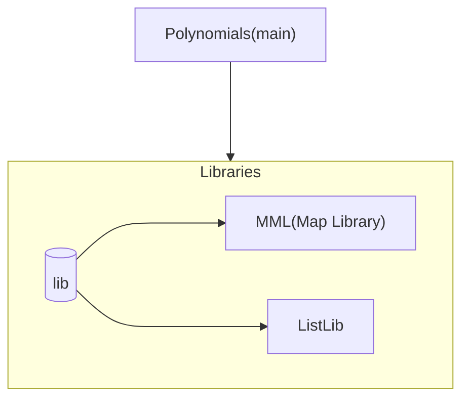

# Проект Полиномы-9
В рамках данного проекта наша команда реализует ПО для работы с полиномами от трех переменных степени не выше 9. Техническое задание, а тажке вся информация о ПО содержится в [___`Отчете`___](https://github.com/SuchkovVN/3821B1PM3-Lab-1-Rear-Officers-Polynomials/blob/main/Otchet%20Lab%204.1.docx)

## Состав команды: 
+ Сучков Владислав 
+ Заботин Максим
+ Мартынов Александр
+ Колганов Даниил
+ Демидов Егор

## Структура проекта 
Здесь будет описана структура проекта, если будет, конечно (снизу заглушка)

## Задачи 
- [X] Создать репозиторий  
- [X] Создать отчет 
- [ ] Подготовить описание структуры проекта
- [ ] Подготовить окружение проекта 
- [ ] Встроить все необходимые библеотеки
- [ ] Закончить лабу
